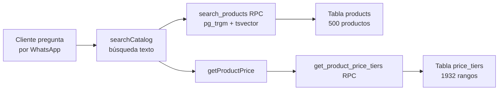
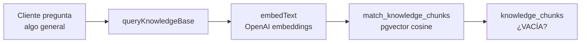
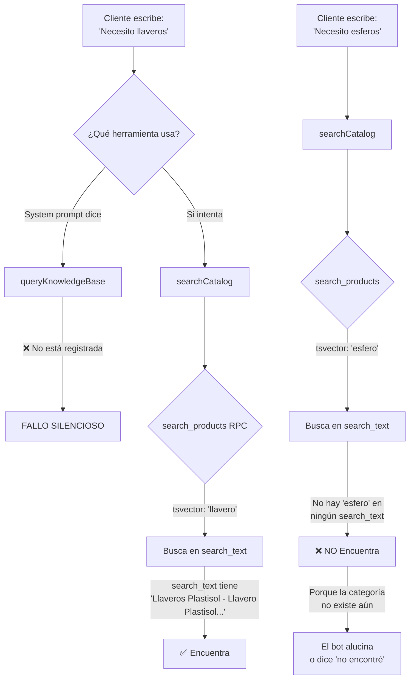

# 🔍 Diagnóstico Completo: Base de Conocimiento — Zoom Publicidad

> **Estado:** Solo análisis. No se ha modificado nada.  
> **Fecha:** 2026-06-25

---

## 1. Entendimiento del Sistema Actual

El bot tiene **dos sistemas de conocimiento completamente separados** que no se hablan entre sí:

### Sistema A: Catálogo SQL (Productos y Precios)


- **Tablas:** `products` (500 filas) + `price_tiers` (1932 filas) + `categories` (53 categorías)
- **Búsqueda:** Full-text PostgreSQL (`to_tsvector/tsquery`) + trigram similarity (`pg_trgm`)
- **Campo de búsqueda:** `search_text` (concatenación de categoría + nombre + descripción)
- **Herramientas del agente:** `searchCatalog` → `getProductPrice`
- **Fortaleza:** Precios EXACTOS, sin alucinación, cálculo por SQL

### Sistema B: RAG Vectorial (Conocimiento General)


- **Tablas:** `knowledge_documents` + `knowledge_chunks` (embeddings vector 1536)
- **Búsqueda:** Cosine similarity con pgvector
- **Estado:** ⚠️ **Probablemente VACÍA** — no hay evidencia de que se hayan cargado chunks
- **Herramienta:** `queryKnowledgeBase` (actualmente detecta tabla vacía y redirige al catálogo)

---

## 2. Problemas Encontrados

### 🔴 Problema #1: La herramienta `queryKnowledgeBase` NO está registrada en el agente

```typescript
// lib/agent/index.ts — línea 135-143
tools: {
  getAvailableSlots: getAvailableSlotsTool(toolContext),
  bookAppointment: bookAppointmentTool(toolContext),
  cancelAppointment: cancelAppointmentTool(toolContext),
  rescheduleAppointment: rescheduleAppointmentTool(toolContext),
  searchCatalog: searchCatalogTool(),
  getProductPrice: getProductPriceTool(),
  saveContactInfo: saveContactInfoTool(toolContext),
  // ❌ queryKnowledgeBase NO ESTÁ AQUÍ
  // ❌ requestHumanHandoff TAMPOCO
},
```

**Impacto:** Aunque el system prompt dice "llama a `queryKnowledgeBase`", el bot **literalmente no puede hacerlo** porque la herramienta no está conectada. Todo el conocimiento que no sea producto+precio (políticas, jerga comercial, procesos, FAQ) es **inaccesible**.

### 🔴 Problema #2: Glosario comercial cargado en `knowledge_chunks` pero sin herramienta para consultarlo

El panel de Base de Conocimiento permite guardar términos de glosario (ej: "mil de presentación" = 1000 tarjetas), pero estos se guardan en `knowledge_chunks` vía embeddings. Como `queryKnowledgeBase` no está en las tools del agente, **el glosario es invisible**.

### 🟡 Problema #3: `search_products` RPC devuelve campos incompletos

La función SQL actual retorna:
```sql
-- schema_supabase.sql (cuadernos)
select p.id, p.name, c.name as category, p.description, p.unit, similarity(...)
```

Pero el código TypeScript en `search-catalog.ts` espera:
```typescript
product_id: row.id,
category: row.category,
name: row.name,
unit: row.unit,
description: row.description,
notes: row.notes,          // ❌ NO lo devuelve la función SQL
requires_area: row.requires_area  // ❌ NO lo devuelve la función SQL
```

**Impacto:** `notes` y `requires_area` siempre serán `undefined`, perdiendo información crucial como "Precio total para el lote" o "Se cobra por área cm²".

### 🟡 Problema #4: `search_text` es pobre y redundante

Ejemplo actual:
```
Bolsas Ecológicas - Plana Troquelada - Bolsa Ecológica Plana Troquelada 34 Ancho x 50 Alto cm -
```

Problemas:
- Repite "Bolsa Ecológica Plana Troquelada" dos veces
- No incluye sinónimos (bolsa eco, tula, morral, costal)
- No incluye materiales ni técnicas de marcación compatibles
- Sin `notes` que contiene info crucial para la búsqueda

### 🟡 Problema #5: No hay subcategorías formales

El CSV de categorías tiene 53 categorías planas. Ejemplo:
```
Bolsas Ecológicas - Bolsas Tres Fuelles
Bolsas Ecológicas - Plana Con Manija
Bolsas Ecológicas - Plana Troquelada
```

Esto no es un árbol de categorías sino subcategorías embebidas en el nombre con ` - `. Funciona para 53, pero NO escala a 6000 productos con materiales, técnicas y variantes.

### 🟡 Problema #6: Sistema prompt tiene reglas de negocio hardcodeadas

Todo el proceso de cotización de cuadernos (líneas 156-199 del system prompt) está **hardcodeado directamente en el prompt**. Esto:
- No escala (cada producto complejo requiere más líneas)
- No es mantenible (hay que editar código para cambiar reglas)
- Consume tokens de contexto

### 🟡 Problema #7: No hay validación de integridad de datos en la carga

El script `validate_and_load.js` existe pero no hay evidencia de que se ejecute automáticamente. Hay anomalías en los datos:
- Precios en $0 para algunos mugs ("Mug Tintero Interno Color")
- Rangos superpuestos en BOLSATEX ("100-500" y "500-1000" ambos incluyen 500)
- Precios que suben cuando deberían bajar ("Manija Sellada 5000-10000: $1767 > 2000-5000: $1677")

---

## 3. ¿Por qué el bot NO encuentra productos correctamente?



**La raíz:** No hay esferos/bolígrafos en el catálogo CSV actual. Los 500 productos son los que se ven en las categorías del CSV. Cuando el usuario menciona productos que NO están en la base (esferos, libretas, termos, etc.), el bot no los encuentra y no puede cotizar.

---

## 4. Propuestas de Solución (3 Opciones)

### Opción A: Arreglo Rápido (1-2 días)
Corregir lo mínimo para que funcione con los 500 productos actuales:

1. **Conectar `queryKnowledgeBase` y `requestHumanHandoff` al agente**
2. **Mejorar la función `search_products`** para devolver `notes` y `requires_area`
3. **Enriquecer `search_text`** con sinónimos de categoría
4. **Ejecutar la migración SQL** de la columna `synonyms`

**Pros:** Rápido, bajo riesgo  
**Contras:** No escala a 6000 productos, no resuelve el problema de agregar productos manuales fácilmente

### Opción B: Reestructuración del Panel (1-2 semanas)
Rediseñar el panel `/conocimiento` para ser la fuente única de verdad:

1. Todo lo de la Opción A
2. **Agregar subcategorías formales** (tabla `subcategories`)
3. **Formulario mejorado de producto** con:
   - Campos de material, técnica de marcación, tamaño
   - Auto-generación de `search_text` inteligente
   - Vista previa de cómo buscaría el bot
4. **Importador CSV masivo** desde el panel (subir un Excel → validar → cargar)
5. **Reglas de negocio como datos** (tabla `pricing_rules`) en vez de hardcodearlas en el prompt

**Pros:** Escalable, mantenible, el usuario gestiona todo desde el panel  
**Contras:** Más tiempo de desarrollo

### Opción C: Arquitectura Híbrida Escalable (2-4 semanas)
Para millones de productos y múltiples organizaciones:

1. Todo lo de Opción A + B
2. **Motor de búsqueda dedicado** (embeddings + full-text en paralelo)
3. **Pipeline de ingesta automatizado**: CSV → Validación → Normalización → Carga → Indexación
4. **Reglas de cotización programables** por categoría (JSON configurable)
5. **Cache de cotizaciones** para consultas frecuentes
6. **Versionado de precios** (historial de cambios)

**Pros:** Escala infinita, multi-tenant real  
**Contras:** Más complejo, más tiempo

---

## 5. Preguntas para ti antes de proceder

> [!IMPORTANT]
> Necesito tu input en estos puntos antes de tocar cualquier código:

1. **¿Los 500 productos del CSV son TODOS los que tiene Zoom Publicidad, o faltan muchos más?** (mencionaste 6000+)

2. **¿Los esferos/bolígrafos que mencionas ya existen en algún Excel/archivo que pueda procesar, o es un ejemplo de lo que FALTA cargar?**

3. **¿Cuál opción prefieres (A, B o C)?** ¿O una combinación?

4. **¿El glosario comercial ya tiene términos cargados en la base de datos de Supabase, o el panel de glosario está vacío?**

5. **¿Las reglas de marcación (Tampografía, Screen, Láser, DTF) ya están como precios en `price_tiers` o necesitan una tabla separada?** En el CSV actual veo que DTF tiene sus propios productos, pero no veo Tampografía/Screen/Láser como servicios adicionales independientes.

6. **¿Quieres que el bot pueda agregar productos via WhatsApp (admin mode), o solo desde el panel web?**
