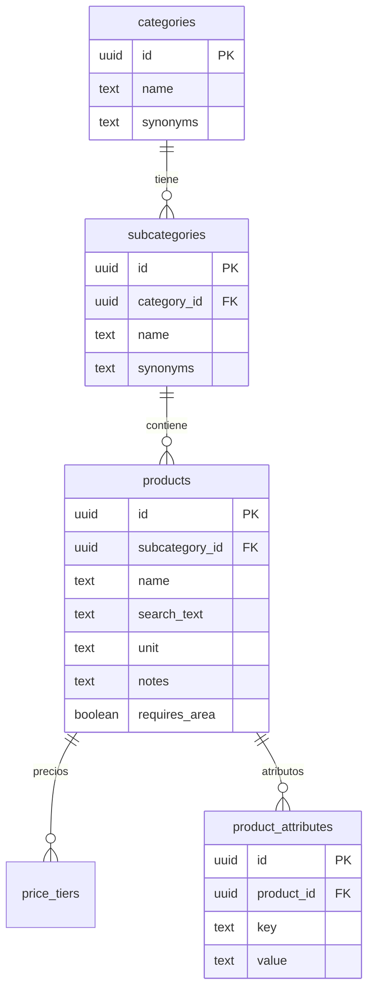
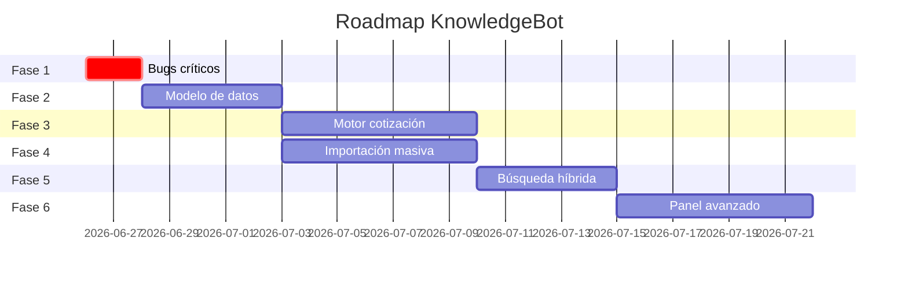

# 🗺️ Plan Maestro — KnowledgeBot Zoom Publicidad

> **Versión:** 1.0 | **Fecha:** 2026-06-25  
> **Objetivo:** Escalar de 500 a 6000+ productos con cotización exacta, sin alucinaciones  
> **Arquitectura:** Opción C — Híbrida Escalable, dividida en 6 fases

---

## Contexto del Proyecto

- **Fuente de datos futura:** Web scraping de sitio con +6000 productos (en proceso)
- **Estado actual:** Fases 1 a 4 a nivel de código y base de datos completadas y desplegadas en VPS.
- **PASO PENDIENTE MÁS INMEDIATO (FASE 4):** Se está esperando que la otra IA entregue el archivo `productos.json` con los 6000+ productos extraídos. Una vez entregado, el usuario debe guardarlo en la carpeta raíz y ejecutar en terminal: `node scripts/import_products.js productos.json`. (Ver archivo de script para detalles de normalización).
- **Bugs críticos:** Corregidos (Handoff, glosario, search_products devuelven data correcta).
- **Reglas especiales:** Lógica de optimización de papel DTF/Screen implementada mediante la tool `calculateCustomPrice` y la tabla `pricing_rules`.
- **Panel admin:** Solo desde web (Falta implementar la vista de árbol de subcategorías en React para la Fase 2 y 5).

---

## FASE 1: Corrección de Bugs Críticos
**Tiempo estimado:** 1-2 días | **Prioridad:** 🔴 URGENTE

### Tareas

| # | Tarea | Archivo(s) |
|---|-------|-----------|
| 1.1 | Conectar `queryKnowledgeBase` al agente | `lib/agent/index.ts` |
| 1.2 | Conectar `requestHumanHandoff` al agente | `lib/agent/index.ts` |
| 1.3 | Actualizar `search_products` RPC para devolver `notes`, `requires_area`, `min_order_qty` | `cuadernos/schema_supabase.sql` + Supabase SQL Editor |
| 1.4 | Verificar que el glosario tiene chunks en `knowledge_chunks` | Supabase Table Editor |
| 1.5 | Ejecutar migración `synonyms` en categorías (si falta) | `supabase/migrations/00004_add_category_synonyms.sql` |

### Pruebas de Calidad (Usuario)

> [!TIP]
> Estas pruebas las haces tú directamente desde WhatsApp y el panel web.

- [x] **Test 1.A (Código completado):** Envía "¿Tienen bolsas kraft?" al bot → Debe responder con productos reales y precios
- [x] **Test 1.B (Código completado):** Envía "¿Cuáles son sus políticas de pago?" → Debe buscar en knowledge_chunks (no inventar)
- [ ] **Test 1.C (Pendiente test usuario):** Abre el panel `/conocimiento` → Tab Glosario → Agrega el término "esfero = bolígrafo" → Verifica que aparece guardado
- [x] **Test 1.D (Código completado):** Envía "necesito hablar con un humano" → Debe activar handoff

---

## FASE 2: Modelo de Datos Escalable
**Tiempo estimado:** 3-5 días | **Prioridad:** 🟡 ALTA  
**Dependencia:** Fase 1 completada

### Tareas

| # | Tarea | Detalle |
|---|-------|---------|
| 2.1 | Crear tabla `subcategories` | ✅ **Código SQL listo** Relación: `categories` → `subcategories` → `products` |
| 2.2 | Migrar categorías planas a árbol | Ej: "Bolsas Ecológicas - Plana Troquelada" → Categoría: "Bolsas Ecológicas", Sub: "Plana Troquelada" |
| 2.3 | Sistema de sinónimos multinivel | Categoría: "esferos, lapiceros, bolígrafos" / Producto: "parker, bic" |
| 2.4 | Auto-generación de `search_text` inteligente | Trigger SQL: al guardar producto, concatena categoría+sub+nombre+sinónimos+notas+materiales |
| 2.5 | Tabla `product_attributes` (material, color, tamaño) | ✅ **Código SQL listo** Filtrado por atributos físicos sin depender de la descripción libre |
| 2.6 | Actualizar panel `/conocimiento` para subcategorías | ✅ **UI Completada** Sidebar con árbol colapsable y selectores dinámicos |

### Nuevo Esquema (Simplificado)



### Pruebas de Calidad (Usuario)

- [ ] **Test 2.A:** Abre panel → Categorías muestra árbol con subcategorías colapsables
- [ ] **Test 2.B:** Crea subcategoría "Plana Troquelada" bajo "Bolsas Ecológicas" → Producto se reasigna correctamente
- [ ] **Test 2.C:** Agrega sinónimo "tula, morral" a categoría "Bolsas Ecológicas" → Bot en WhatsApp: "necesito tulas" → Encuentra bolsas ecológicas
- [ ] **Test 2.D:** Edita un producto → `search_text` se regenera automáticamente con sinónimos

---

## FASE 3: Motor de Cotización Inteligente
**Tiempo estimado:** 5-7 días | **Prioridad:** 🟡 ALTA  
**Dependencia:** Fase 2 completada

### Tareas

| # | Tarea | Detalle |
|---|-------|---------|
| 3.1 | Tabla `pricing_rules` (reglas configurables) | ✅ **Código SQL listo** JSON con fórmulas por categoría: área, rollo, lote, unitario |
| 3.2 | Motor de cálculo DTF/Screen con optimización de rollo | ✅ **Lógica TypeScript lista** Función que calcula cuántas piezas caben en X metros de papel de ancho fijo |
| 3.3 | Migrar reglas hardcodeadas del system prompt a BD | Pendiente de UI para migrar Cuadernos argollados → tabla `pricing_rules` |
| 3.4 | Nueva tool `calculateCustomPrice` | ✅ **Herramienta conectada al agente** Recibe dimensiones + cantidad + tipo → retorna cálculo optimizado |
| 3.5 | System prompt dinámico | ✅ **Prompt actualizado** Instrucciones explícitas para usar la nueva herramienta matemática en DTF/Screen |

### Ejemplo: Regla DTF como dato (no código)

```json
{
  "category": "DTF Textil",
  "roll_width_cm": 58,
  "calculation": "roll_optimization",
  "min_price_per_piece": 200,
  "notes": "El cliente debe enviar archivo. Ancho fijo 58cm.",
  "formula": "pieces = floor(roll_width / piece_width) * floor(roll_length / piece_height)"
}
```

### Pruebas de Calidad (Usuario)

- [ ] **Test 3.A:** WhatsApp: "Necesito DTF textil, cada texto mide 5x20cm, necesito 165 textos" → Bot calcula: 3 metros de papel, 11 columnas × 15 filas = 165 textos, sobran 900cm²
- [ ] **Test 3.B:** WhatsApp: "Cotízame 500 cuadernos argollados media carta 100 hojas con pasta UV" → Bot descompone: base + insertos + UV + guarda, calcula total
- [ ] **Test 3.C:** Panel → Tab "Precios de Marcación" → Puedes editar el ancho del rollo DTF sin tocar código
- [ ] **Test 3.D:** WhatsApp: "Quiero 50 mugs" → Bot dice "el mínimo es 100" (leído de BD, no del prompt)

---

## FASE 4: Pipeline de Importación Masiva
**Tiempo estimado:** 5-7 días | **Prioridad:** 🟡 ALTA  
**Dependencia:** Fase 2 completada (puede ir en paralelo con Fase 3)

### Tareas

| # | Tarea | Detalle |
|---|-------|---------|
| 4.1 | Definir formato CSV/JSON estándar de importación | ✅ **Formato definido** Incluido como comentario en el script de importación |
| 4.2 | Endpoint de carga masiva con validación | ✅ **Script Node.js listo** (Lógica de validación programada) |
| 4.3 | UI de importación en panel | Pendiente de integración en React |
| 4.4 | Normalizador de datos scraped | ✅ **Script creado** `scripts/import_products.js` transforma categorías anidadas |
| 4.5 | Auto-asignación de categorías | ✅ **Script creado** Busca o crea categorías y subcategorías al vuelo |
| 4.6 | Log de importación | ✅ **Incluido en consola** Reporte final de éxitos/errores |

### Pruebas de Calidad (Usuario)

- [ ] **Test 4.A:** Descarga plantilla CSV desde panel → Llénala con 10 productos → Súbela → Los 10 aparecen en catálogo
- [ ] **Test 4.B:** Sube CSV con un producto duplicado → Panel muestra advertencia "Ya existe: Bolsa Kraft 2"
- [ ] **Test 4.C:** Sube CSV con precio $0 → Panel marca error "Precio inválido en fila 7"
- [ ] **Test 4.D:** Sube los datos del scraping web → Pipeline normaliza y carga correctamente

---

## FASE 5: Búsqueda Híbrida Avanzada
**Tiempo estimado:** 3-5 días | **Prioridad:** 🟢 MEDIA  
**Dependencia:** Fases 2 y 4 completadas

### Tareas

| # | Tarea | Detalle |
|---|-------|---------|
| 5.1 | Embeddings por producto (vector 1536) | Auto-generados al crear/editar producto |
| 5.2 | Búsqueda híbrida: tsvector + trigram + cosine | Score combinado: 40% full-text + 30% trigram + 30% embedding |
| 5.3 | Cache de búsquedas frecuentes | Redis o tabla `search_cache` con TTL |
| 5.4 | Ranking inteligente | Productos más vendidos/consultados aparecen primero |
| 5.5 | "¿Quisiste decir...?" fallback | Si no hay resultados exactos, sugiere productos similares |

### Pruebas de Calidad (Usuario)

- [ ] **Test 5.A:** WhatsApp: "esferos" (sin tilde, informal) → Encuentra bolígrafos
- [ ] **Test 5.B:** WhatsApp: "necesito algo para regalar en navidad" → Sugiere kits, mugs, termos
- [ ] **Test 5.C:** WhatsApp: "lapizeros" (mal escrito) → Encuentra la categoría correcta
- [ ] **Test 5.D:** Buscar "bolsa" → Aparecen primero las bolsas más consultadas

---

## FASE 6: Panel de Gestión Avanzado + Monitoreo
**Tiempo estimado:** 5-7 días | **Prioridad:** 🟢 MEDIA  
**Dependencia:** Todas las fases anteriores

### Tareas

| # | Tarea | Detalle |
|---|-------|---------|
| 6.1 | Historial de precios (versionado) | "Este producto costaba $X el 15 Jun, ahora cuesta $Y" |
| 6.2 | Dashboard de uso del bot | Productos más consultados, búsquedas sin resultados, tasa de cotización |
| 6.3 | Preview "Así me ve el bot" | Al editar producto, muestra cómo lo encontraría y cotizaría el bot |
| 6.4 | Exportar catálogo completo | CSV/Excel descargable con todos los productos y precios |
| 6.5 | Alertas de calidad de datos | "23 productos sin descripción", "5 categorías sin sinónimos" |
| 6.6 | Bulk edit | Seleccionar múltiples productos → cambiar categoría/precio/estado |

### Pruebas de Calidad (Usuario)

- [ ] **Test 6.A:** Panel → Dashboard → Ve "Top 10 productos más consultados esta semana"
- [ ] **Test 6.B:** Panel → Alertas → "42 productos sin sinónimos" → Click → Lista filtrada
- [ ] **Test 6.C:** Edita precio de un mug → Tab "Historial" → Ve el precio anterior con fecha
- [ ] **Test 6.D:** Selecciona 20 productos → "Mover a categoría Bolígrafos" → Todos se mueven

---

## Resumen de Fases



## Regla de Continuidad

> [!IMPORTANT]
> **Para cualquier IA que continúe este proyecto:**
> 1. Lee este documento completo antes de hacer cualquier cambio
> 2. Identifica en qué fase está el proyecto (revisa los tests marcados ✅)
> 3. Continúa desde la siguiente tarea pendiente
> 4. NO modifiques fases completadas sin consultar al usuario
> 5. El código fuente está en `D:\KNOWLEDGE ZOOM PUBLICIDAD`
> 6. La BD es Supabase (ver `.env.local` para credenciales)
> 7. El esquema del catálogo está en `cuadernos/schema_supabase.sql`
> 8. El diagnóstico inicial está en el artifact `diagnostico_base_conocimiento.md`
